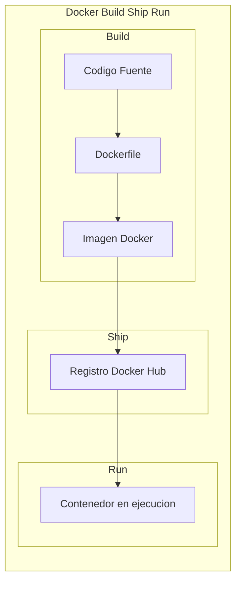
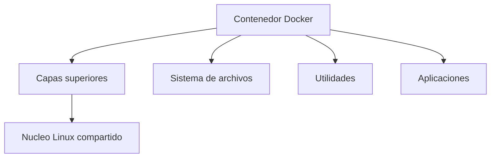
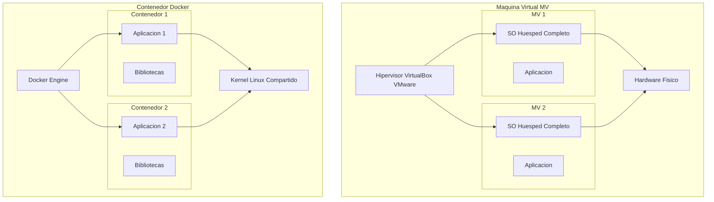
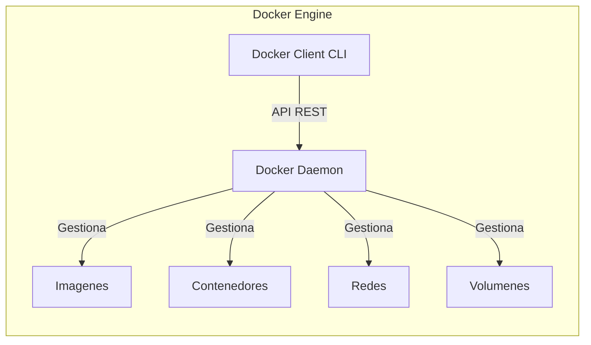
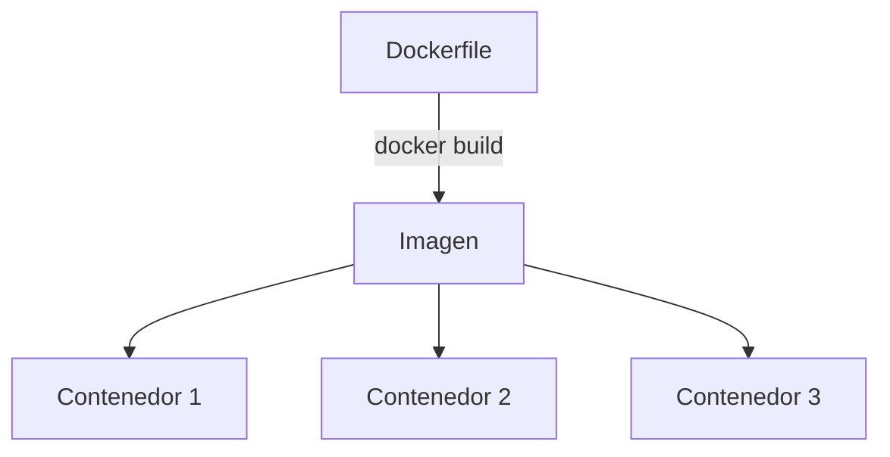
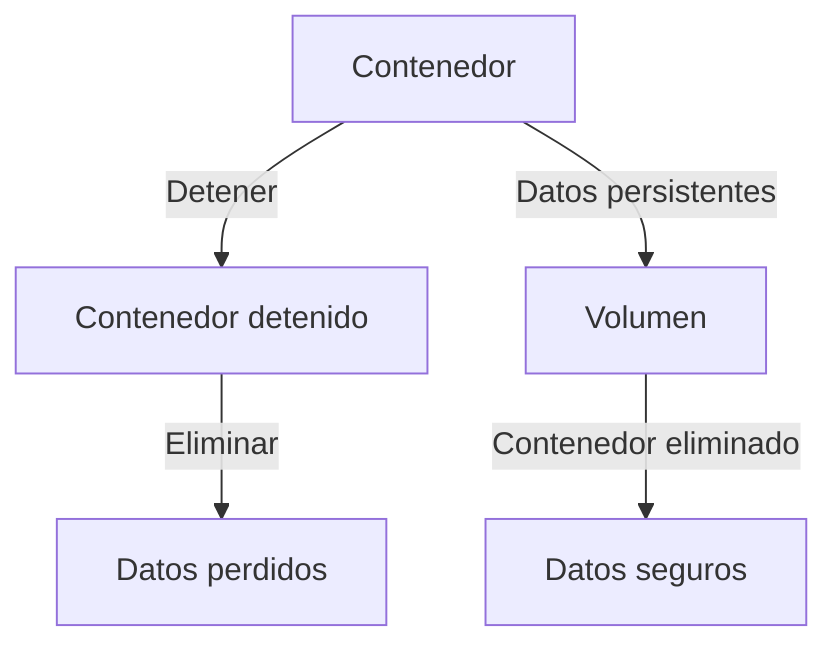

- [1. Conceptos Fundamentales de Docker](#1-conceptos-fundamentales-de-docker)
  - [1.1. ¿Qué es Docker?](#11-qué-es-docker)
    - [El Eslogan de Docker](#el-eslogan-de-docker)
    - [Propósito de Docker](#propósito-de-docker)
    - [¿Qué es un Contenedor?](#qué-es-un-contenedor)
  - [1.2. Contenedores vs. Máquinas Virtuales](#12-contenedores-vs-máquinas-virtuales)
    - [Diferencias de Arquitectura](#diferencias-de-arquitectura)
    - [Ventajas de los Contenedores](#ventajas-de-los-contenedores)
    - [Desventajas](#desventajas)
  - [1.3. Arquitectura y Componentes de Docker](#13-arquitectura-y-componentes-de-docker)
    - [Componentes Principales](#componentes-principales)
    - [Docker Engine](#docker-engine)
    - [Imágenes (Images)](#imágenes-images)
    - [Contenedores (Containers)](#contenedores-containers)
  - [1.4. Conceptos de Almacenamiento](#14-conceptos-de-almacenamiento)
    - [Naturaleza Efímera](#naturaleza-efímera)

# 1. Conceptos Fundamentales de Docker

En este módulo aprenderás los fundamentos de Docker, la plataforma de contenedores más popular para virtualización ligera.

---

## 1.1. ¿Qué es Docker?

Docker es una **plataforma de código abierto** para desarrollar, lanzar y ejecutar aplicaciones. Es la tecnología de contenedores más popular que existe.

> 📝 **Nota del Profesor:** "Docker es como el estándar de envío de mercancías: un contenedor Docker es como un contenedor de transporte marítimo. Todo va dentro, sellado, y llega igual a cualquier parte del mundo. Si funciona en tu máquina, funciona en la mía."

### El Eslogan de Docker

> 💡 **Tip del Examinador:** Pregunta tipica: "¿Cuales son las tres fases del eslogan de Docker?"
> **Respuesta:** Build construir, Ship enviar y Run ejecutar. Cualquier aplicacion en cualquier lugar."

### Propósito de Docker

El objetivo principal de Docker es **automatizar el despliegue de aplicaciones** dentro de contenedores de software.

**Beneficios clave:**

- **Flexibilidad**: Separa las aplicaciones de la infraestructura
- **Portabilidad**: Funciona en cualquier lugar (desarrollo, producción, nube)
- **Eficiencia**: Uso óptimo de recursos del sistema
- **Agilidad**: Desarrollo más rápido y cómodo

### ¿Qué es un Contenedor?

Un contenedor es un **paquete de elementos** que permite ejecutar una aplicación de forma aislada.

> 📝 **Analogia del edificio:** "Imagina un edificio de apartamentos maquinas virtuales: cada apartamento tiene su propia cocina, baño y sala SO completo. Ahora imagina un estudio compartido contenedores: todos comparten la cocina del edificio kernel, pero cada uno tiene su habitacion privada y aislada."

**Tipos de aplicaciones en contenedores:**

- **Aplicaciones de red**: Web, bases de datos, colas de mensajes, caches
- **Aplicaciones CLI**: Compiladores, generadores, conversores
- **Aplicaciones graficas**: Posible pero no es el uso principal

---

## 1.2. Contenedores vs. Máquinas Virtuales

La diferencia fundamental está en cómo comparten los recursos del sistema.

> 💡 **Regla nemotecnica:** "Las MVs tienen SU SO como llevar tu casa entera de viaje, los Contenedores comparten kernel como llevar solo tu maleta."

### Diferencias de Arquitectura

| Aspecto | Maquinas Virtuales | Contenedores |
|---------|-------------------|--------------|
| **Virtualizacion** | Hardware completo | Solo aplicaciones |
| **Sistema Operativo** | SO huesped completo | Comparten kernel |
| **Hipervisor** | Necesitan hipervisor | No necesitan |
| **Peso** | Varios GB | Pocos MB |
| **Arranque** | Minutos | Segundos |

### Ventajas de los Contenedores

> 💡 **Tip del Examinador:** Pregunta tipica: "¿Por que los contenedores son mas ligeros que las maquinas virtuales?"
> **Respuesta:** Porque los contenedores comparten el kernel del sistema operativo y no necesitan un SO huesped completo. Una imagen nginx es de 15MB mientras que una MV minima con SO seria varios GB."

| Ventaja | Descripcion |
|---------|-------------|
| **Ligereza** | Contenedores de pocos MB. nginx:alpine son solo 15MB |
| **Eficiencia** | Consumen solo la memoria necesaria |
| **Velocidad** | Arranque en segundos o milisegundos |
| **Portabilidad** | Multiplataforma sin adaptaciones |
| **Repetibilidad** | Facil compartir y mover entre entornos |

### Desventajas

- **Seguridad**: Compartir el kernel puede ser riesgo si hay vulnerabilidades
- **Complejidad**: Mantenimiento puede ser mas complejo
- **Almacenamiento**: Por defecto no hay persistencia

---

## 1.3. Arquitectura y Componentes de Docker

Docker consta de tres componentes principales:

### Componentes Principales

1. **Docker Engine**: El motor de contenedores
2. **Imagenes Docker**: Plantillas de solo lectura
3. **Registro Docker Hub**: Repositorio de imagenes

### Docker Engine

Es una aplicacion cliente-servidor:

**Componentes del Engine:**

- **Docker Daemon (dockerd)**: Servidor en segundo plano que gestiona objetos Docker
- **API REST**: Interfaz para interactuar con el daemon
- **Docker Client (CLI)**: Linea de comandos que envia peticiones

### Imágenes (Images)

- **Plantillas de solo lectura e inmutables**
- Contienen instrucciones para crear un contenedor
- Se crean mediante un **Dockerfile**
- Una imagen puede generar múltiples contenedores

### Contenedores (Containers)

- **Instancia ejecutable** de una imagen
- Pueden crearse, iniciarse, detenerse, moverse o eliminarse
- Se ejecutan en entorno aislado con sus propios recursos
- Si se elimina, los datos se pierden (a menos que haya persistencia)

---

## 1.4. Conceptos de Almacenamiento

### Naturaleza Efímera

> 📝 **Nota del Profesor:** "Los contenedores son como globos: inflate usas y tiras. Si quieres guardar algo, necesitas un volumen."

Los contenedores son **efímeros** por diseño. El almacenamiento no es persistente:

**Soluciones para persistencia:**

1. **Volúmenes**: Gestionados por Docker
2. **Bind Mounts**: Directorios del host enlazados al contenedor
3. **tmpfs**: Almacenamiento en memoria (se pierde al reiniciar)
