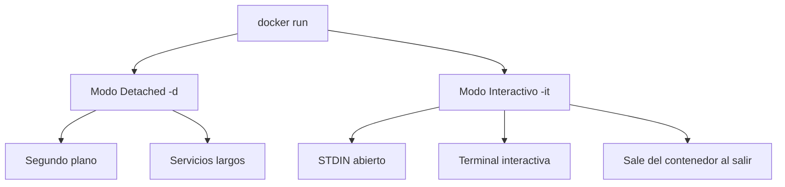
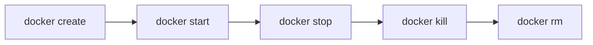
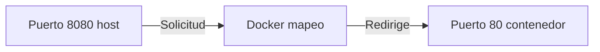

- [2. Instalación y Comandos Básicos de Docker](#2-instalación-y-comandos-básicos-de-docker)
  - [2.1. Instalación y Configuración Inicial](#21-instalación-y-configuración-inicial)
    - [Requisitos Previos](#requisitos-previos)
    - [Instalación en Ubuntu](#instalación-en-ubuntu)
    - [Comprobación Inicial](#comprobación-inicial)
    - [Permisos de Usuario](#permisos-de-usuario)
  - [2.2. Manejo del Ciclo de Vida del Contenedor](#22-manejo-del-ciclo-de-vida-del-contenedor)
    - [Ejecución de Contenedores](#ejecución-de-contenedores)
    - [Modos de Ejecución](#modos-de-ejecución)
    - [Identificación de Contenedores](#identificación-de-contenedores)
    - [Operaciones del Ciclo de Vida](#operaciones-del-ciclo-de-vida)
    - [Inspección y Logs](#inspección-y-logs)
  - [2.3. Comandos Avanzados de Ejecución y Acceso](#23-comandos-avanzados-de-ejecución-y-acceso)
    - [Acceder a la Shell](#acceder-a-la-shell)
    - [Mapeo de Puertos](#mapeo-de-puertos)
    - [Variables de Entorno](#variables-de-entorno)
    - [Crear Imagen desde Contenedor](#crear-imagen-desde-contenedor)
  - [2.4. Gestión de Imágenes](#24-gestión-de-imágenes)
    - [Comandos de Imágenes](#comandos-de-imágenes)
    - [Buscar Imágenes en Docker Hub](#buscar-imágenes-en-docker-hub)


# 2. Instalación y Comandos Básicos de Docker

En este módulo aprenderás a instalar Docker y usar los comandos fundamentales para gestionar contenedores.

---

## 2.1. Instalación y Configuración Inicial

### Requisitos Previos

Antes de instalar Docker Engine, consulta la documentación oficial ya que el proceso varía según el sistema operativo.

### Instalación en Ubuntu

```bash
# Actualizar paquetes
sudo apt update

# Configurar repositorio Docker
sudo apt install apt-transport-https ca-certificates curl software-properties-common
curl -fsSL https://download.docker.com/linux/ubuntu/gpg | sudo apt-key add -
sudo add-apt-repository "deb [arch=amd64] https://download.docker.com/linux/ubuntu focal stable"

# Instalar Docker CE
sudo apt install docker-ce

# Verificar instalacion
docker --version
```

### Comprobación Inicial

El primer paso para verificar que Docker funciona es ejecutar:

```bash
$ docker run hello-world
```

**Lo que ocurre en segundo plano:**

1. El Daemon busca la imagen `hello-world` localmente
2. Si no la encuentra, la descarga de Docker Hub
3. Crea un contenedor y ejecuta el programa
4. Muestra el mensaje de confirmación y termina

> 📝 **Nota del Profesor:** "Si ves el mensaje 'Hello from Docker!', significa que Docker esta correctamente instalado y funcionando."

### Permisos de Usuario

Por defecto, solo el usuario **root** puede ejecutar comandos Docker:

```bash
# Añadir usuario al grupo docker
sudo usermod -aG docker $USER

# Recargar grupos (o cerrar sesion)
su - $USER

# Verificar
docker ps
```

> ⚠️ **Advertencia:** "Añadir usuarios al grupo docker es un equivalente a dar acceso root. Solo hazlo en entornos de desarrollo."

---

## 2.2. Manejo del Ciclo de Vida del Contenedor

### Ejecución de Contenedores

El comando `docker run` crea y ejecuta un contenedor inmediatamente:

```bash
# Sintaxis basica
docker run [OPCIONES] IMAGEN [COMANDO]

# Ejemplo
docker run nginx:alpine
```

### Modos de Ejecución



| Modo | Opcion | Descripcion | Ejemplo |
|------|--------|-------------|---------|
| **Detached** | `-d` | Segundo plano | `docker run -d nginx` |
| **Interactivo** | `-it` | Terminal | `docker run -it ubuntu bash` |

### Identificación de Contenedores

```bash
# Ver contenedores en ejecucion
docker ps

# Ver todos los contenedores
docker ps -a

# Ver solo IDs
docker ps -q
```

**Formatos de identificacion:**

| Tipo | Ejemplo | Uso |
|------|---------|-----|
| **ID corto** | `a1b2c3d4e5f6` | Primeros 12 caracteres |
| **Nombre** | `nginx-server` | Con `--name` |
| **Nombre aleatorio** | `peaceful_hopper` | Si no se especifica |

### Operaciones del Ciclo de Vida

```bash
# Crear sin iniciar
docker create --name mi_contenedor nginx

# Iniciar contenedor detenido
docker start mi_contenedor

# Detener suavemente (SIGTERM)
docker stop mi_contenedor

# Detener forzosamente (SIGKILL)
docker kill mi_contenedor

# Eliminar contenedor
docker rm mi_contenedor

# Eliminar contenedor en ejecucion
docker rm -f mi_contenedor
```

> 💡 **Regla nemotecnica:** "Create Start Stop Kill Remove. Las 5 operaciones basicas del ciclo de vida."



### Inspección y Logs

```bash
# Ver logs del contenedor
docker logs mi_contenedor

# Ver logs en tiempo real
docker logs -f mi_contenedor

# Inspeccionar detalles
docker inspect mi_contenedor

# Ver solo la IP
docker inspect -f '{{range .NetworkSettings.Networks}}{{.IPAddress}}{{end}}' mi_contenedor

# Ver puertos mapeados
docker port mi_contenedor
```

---

## 2.3. Comandos Avanzados de Ejecución y Acceso

### Acceder a la Shell

Para ejecutar comandos en un contenedor ya en ejecucion:

```bash
# Ejecutar comando en contenedor
docker exec mi_contenedor ls /app

# Obtener shell interactiva
docker exec -it mi_contenedor /bin/bash

# Ejecutar como usuario especifico
docker exec -u usuario mi_contenedor whoami
```

> 📝 **Nota del Profesor:** "docker exec es como telnet o SSH pero dentro del contenedor. Es la forma recomendada de acceder, no instales SSH en contenedores."

### Mapeo de Puertos

```bash
# Sintaxis: -p PUERTO_HOST:PUERTO_CONTENEDOR
docker run -d -p 8080:80 nginx:alpine

# Mapear puerto aleatorio
docker run -d -P nginx

# Ver puertos mapeados
docker port mi_contenedor
```



**Ejemplo practico:**

```bash
# Servidor web en puerto 8080
docker run -d -p 8080:80 --name mi_web nginx
# Acceder: http://localhost:8080
```

### Variables de Entorno

```bash
# Una variable
docker run -e MI_VARIABLE=valor nginx

# Multiples variables
docker run -e DB_HOST=localhost -e DB_PORT=5432 mi_app

# Desde archivo .env
docker run --env-file .env mi_app

# Ver variables de un contenedor
docker inspect -f '{{range .Config.Env}}{{println .}}{{end}}' mi_contenedor
```

### Crear Imagen desde Contenedor

```bash
# Guardar estado de un contenedor como imagen
docker commit -m "Descripcion" -a "Autor" CONTENEDOR nombre_imagen

# Ejemplo
docker commit -m "Nginx con configuracion personalizada" mi_nginx mi_nginx:v1
```

> ⚠️ **Advertencia:** "docker commit crea imagenes pero no es reproducible. Usa Dockerfile para produccion."

---

## 2.4. Gestión de Imágenes

### Comandos de Imágenes

```bash
# Listar imagenes locales
docker images
docker image ls

# Eliminar imagen
docker rmi nombre_imagen

# Eliminar imagen forzada
docker rmi -f nombre_imagen

# Eliminar imagenes sin usar
docker image prune

# Eliminar todas las imagenes
docker rmi $(docker images -q)
```

### Buscar Imágenes en Docker Hub

```bash
# Buscar imagen
docker search nginx

# Buscar imagenes oficiales
docker search --filter "is-official=true" nginx

# Top 5 mas populares
docker search --limit 5 nginx
```

> 📝 **Nota del Profesor:** "Cuando busques imagenes, prioriza las oficiales tienen el simbolo OK y han sido verificadas por Docker."
