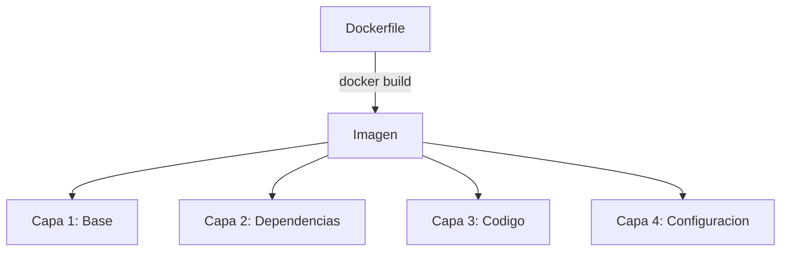
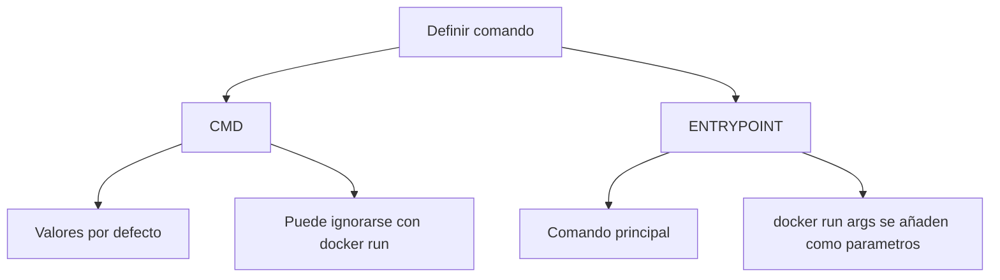
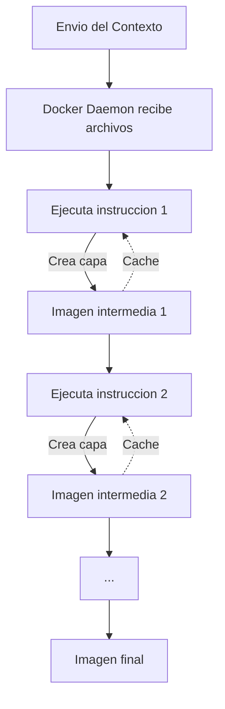

- [3. Creación y Optimización de Imágenes (Dockerfile)](#3-creación-y-optimización-de-imágenes-dockerfile)
  - [3.1. Estructura y Comandos del Dockerfile](#31-estructura-y-comandos-del-dockerfile)
    - [¿Qué es el Dockerfile?](#qué-es-el-dockerfile)
    - [Construcción de la Imagen](#construcción-de-la-imagen)
    - [Instrucciones Fundamentales](#instrucciones-fundamentales)
  - [3.2. Directivas de Configuración y Metadatos](#32-directivas-de-configuración-y-metadatos)
    - [CMD vs ENTRYPOINT](#cmd-vs-entrypoint)
    - [Configuración de Entorno](#configuración-de-entorno)
    - [Configuración de Red y Persistencia](#configuración-de-red-y-persistencia)
  - [3.3. Creación y Gestión de Imágenes](#33-creación-y-gestión-de-imágenes)
    - [Proceso de Build](#proceso-de-build)
    - [Multi-Stage Build](#multi-stage-build)
  - [3.4. Buenas Prácticas y Optimización](#34-buenas-prácticas-y-optimización)
    - [Minimizar el Tamaño](#minimizar-el-tamaño)
    - [Optimizar la Caché](#optimizar-la-caché)
    - [Seguridad](#seguridad)
    - [Checklist de Dockerfile Seguro](#checklist-de-dockerfile-seguro)


# 3. Creación y Optimización de Imágenes (Dockerfile)

En este módulo aprenderás a crear imágenes Docker usando Dockerfile y las mejores prácticas de optimización.

---

## 3.1. Estructura y Comandos del Dockerfile

### ¿Qué es el Dockerfile?

El **Dockerfile** es la **receta** o archivo de texto plano que define las instrucciones para crear una imagen Docker.



> 📝 **Nota del Profesor:** "El Dockerfile es como una receta de cocina: instrucciones paso a paso para crear un plato imagen. Si sigues la misma receta, obtienes el mismo resultado."

### Construcción de la Imagen

```bash
# Construir imagen
docker build -t nombre_imagen .

# Construir con etiqueta
docker build -t mi_app:v1 .

# Construir desde otro directorio
docker build -t mi_app /path/al/contexto

# Construir sin cache
docker build --no-cache -t mi_app .
```

**Contexto de Construcción:**

```bash
# El punto . indica el directorio actual como contexto
docker build -t mi_app .

# .dockerignore excluye archivos del contexto
echo "node_modules" > .dockerignore
echo ".git" >> .dockerignore
echo "*.log" >> .dockerignore
```

### Instrucciones Fundamentales

```dockerfile
# FROM: Imagen base (OBLIGATORIA como primera instruccion)
FROM ubuntu:20.04

# RUN: Ejecuta comandos durante el build
RUN apt-get update && apt-get install -y nginx

# COPY: Copia archivos del contexto al contenedor
COPY ./app /var/www/html

# ADD: Similar a COPY pero con funcionalidades extra
ADD https://example.com/file.tar.gz /tmp/

# CMD: Comando por defecto al ejecutar el contenedor
CMD ["nginx", "-g", "daemon off;"]

# ENTRYPOINT: Define el comando principal
ENTRYPOINT ["python", "app.py"]
```

> 💡 **Tip del Examinador:** Pregunta tipica: "¿Cual es la diferencia entre COPY y ADD?"
> **Respuesta:** COPY solo copia archivos. ADD puede copiar archivos remotos y extraer tar automaticamente. Usa COPY a menos que necesites las funcionalidades extras de ADD."

---

## 3.2. Directivas de Configuración y Metadatos

### CMD vs ENTRYPOINT



**Comparativa CMD vs ENTRYPOINT:**

| Instruccion | Proposito | Comportamiento |
|-------------|-----------|----------------|
| **CMD** | Valores por defecto | Se ignora si el usuario especifica comando |
| **ENTRYPOINT** | Comando principal | Los argumentos se añaden al ENTRYPOINT |

**Ejemplo combinado:**

```dockerfile
#ENTRYPOINT define el comando
ENTRYPOINT ["curl", "-s"]

#CMD proporciona el argumento por defecto
CMD ["http://localhost"]

#docker run mi_imagen http://google.com -> curl -s http://google.com
#docker run mi_imagen -> curl -s http://localhost
```

### Configuración de Entorno

```dockerfile
# Variables de entorno
ENV APP_PORT=8080
ENV APP_ENV=production

# Directorio de trabajo
WORKDIR /app

# Usuario no root (SEGURIDAD)
RUN useradd -m appuser
USER appuser

# Exponer puerto (informativo)
EXPOSE 8080

# Metadatos
LABEL version="1.0"
LABEL description="Mi aplicacion web"
```

### Configuración de Red y Persistencia

```dockerfile
# VOLUME: Punto de montaje persistente
VOLUME ["/var/data"]
VOLUME ["/var/logs", "/etc/config"]

# HEALTHCHECK: Verificar estado del contenedor
HEALTHCHECK CMD curl --fail http://localhost:8080 || exit 1
HEALTHCHECK --interval=30s --timeout=10s --start-period=5s --retries=3 \
    CMD wget --quiet --tries=1 --spider http://localhost/ || exit 1
```

---

## 3.3. Creación y Gestión de Imágenes

### Proceso de Build



**Pasos del proceso:**

1. CLI empaqueta el contexto y envia al Daemon
2. Daemon procesa cada instruccion del Dockerfile
3. Cada instruccion crea una capa (Union Filesystem)
4. Si una capa falla, el build se detiene
5. Las imagenes intermedias se almacenan en cache

### Multi-Stage Build

```dockerfile
# ETAPA 1: Compilacion (pesada)
FROM golang:1.20 AS builder
WORKDIR /app
COPY go.mod go.sum ./
RUN go mod download
COPY . .
RUN go build -o main .

# ETAPA 2: Ejecucion (ligera)
FROM alpine:latest
WORKDIR /app
# Copia SOLO el binario compilado
COPY --from=builder /app/main .
# No copia codigo fuente, dependencias de build, etc.
CMD ["./main"]
```

> 💡 **Regla nemotecnica:** "Multi-stage = Compila en uno, ejecuta en otro. La imagen final solo tiene lo que necesita para ejecutarse, no para compilar."

---

## 3.4. Buenas Prácticas y Optimización

### Minimizar el Tamaño

```dockerfile
# ❌ MAL: Multiples capas innecesarias
RUN apt-get update
RUN apt-get install -y nginx
RUN apt-get clean

# ✅ BIEN: Un solo comando con limpieza
RUN apt-get update && \
    apt-get install -y --no-install-recommends nginx && \
    apt-get clean && \
    rm -rf /var/lib/apt/lists/*
```

### Optimizar la Caché

```dockerfile
# Orden de instrucciones: lo que cambia poco va primero
# 1. Imagen base (cambia raramente)
FROM node:18-alpine

# 2. Dependencias (cambian ocasionalmente)
COPY package.json package-lock.json ./
RUN npm ci --only=production

# 3. Codigo fuente (cambia frecuentemente)
COPY . .

# 4. Comando final
CMD ["node", "index.js"]
```

> 📝 **Nota del Profesor:** "Si el package.json no cambia, la capa de npm ci se reutiliza. Solo rebuild el codigo fuente cuando cambias files."

### Seguridad

```dockerfile
# Usar imagen base minima
FROM node:18-alpine

# No ejecutar como root
RUN addgroup -g 1001 -S nodejs && \
    adduser -S nextjs -u 1001
USER nextjs

# No incluir secretos en la imagen
# ✅ BIEN: Pasar por variable de entorno
# ❌ MAL: COPY secret.key /app/

# Usar etiquetas de version especificas
# ✅ BIEN: FROM node:18-alpine3.19
# ❌ MAL: FROM node:latest
```

### Checklist de Dockerfile Seguro

- [ ] Usar imagen base ligera (alpine, slim)
- [ ] Especificar versiones, no usar latest
- [ ] No incluir secretos o credenciales
- [ ] Ejecutar como usuario no root
- [ ] Minimizar numero de capas
- [ ] Limpiar caches y temporales
- [ ] Usar .dockerignore
- [ ] Incluir HEALTHCHECK
- [ ] Actualizar dependencias regularmente
