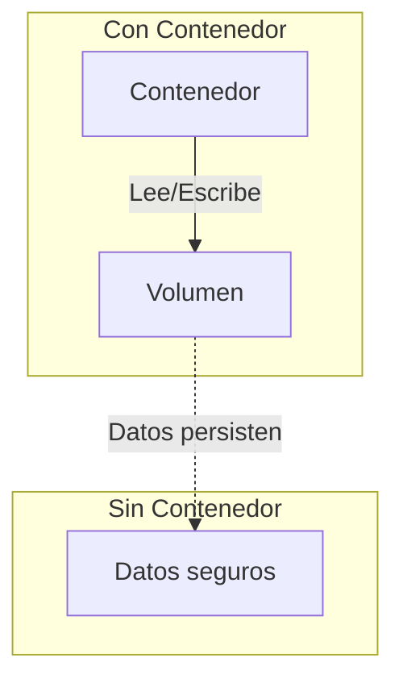
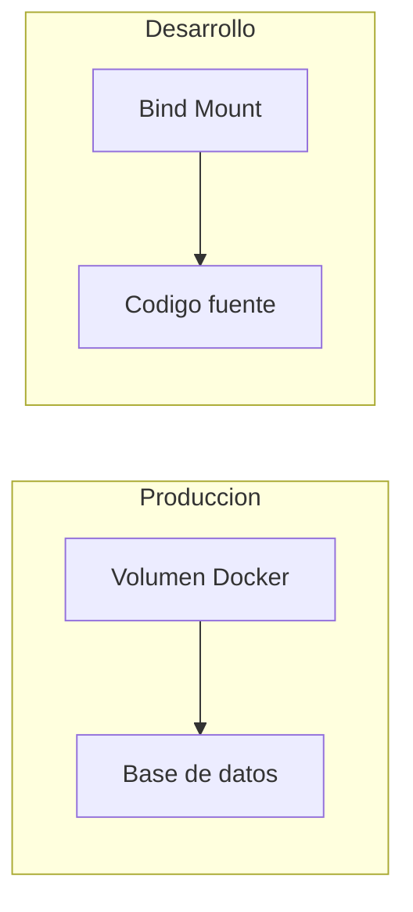
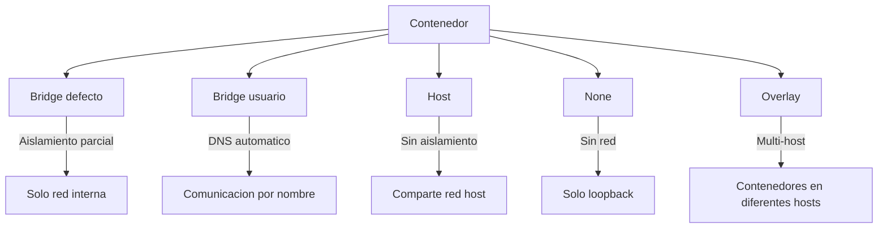
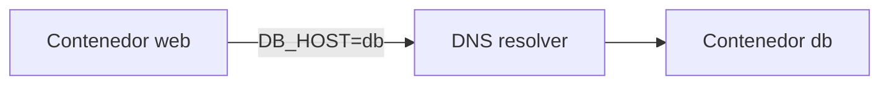
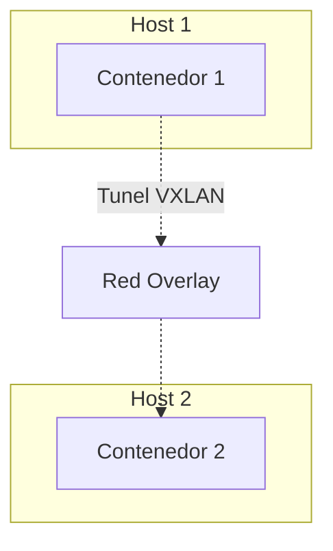

- [4. Persistencia y Redes Avanzadas](#4-persistencia-y-redes-avanzadas)
  - [4.1. Manejo de la Persistencia de Datos](#41-manejo-de-la-persistencia-de-datos)
    - [Volúmenes](#volúmenes)
    - [Bind Mounts](#bind-mounts)
    - [Comparativa: Volúmenes vs Bind Mounts](#comparativa-volúmenes-vs-bind-mounts)
  - [4.2. Configuración de Redes](#42-configuración-de-redes)
    - [Modos de Red](#modos-de-red)
    - [Redes Definidas por Usuario](#redes-definidas-por-usuario)
    - [Resolucion DNS](#resolucion-dns)
    - [Enlace de Contenedores (Legacy)](#enlace-de-contenedores-legacy)
  - [4.3. Redes Overlay y Docker Swarm](#43-redes-overlay-y-docker-swarm)
    - [Ejemplo de Red Overlay en Compose](#ejemplo-de-red-overlay-en-compose)
  - [4.4. Caso Práctico: Aplicación Web con Base de Datos](#44-caso-práctico-aplicación-web-con-base-de-datos)


# 4. Persistencia y Redes Avanzadas

En este módulo aprenderás a gestionar datos persistentes y configurar redes entre contenedores Docker.

---

## 4.1. Manejo de la Persistencia de Datos

Los contenedores son **efímeros** por diseño. Si el contenedor se elimina, los datos internos desaparecen.

### Volúmenes

Los **volúmenes** son la forma preferida de gestionar almacenamiento persistente en Docker.



**Características de los volúmenes:**

- Gestionados por Docker
- Persisten más allá del ciclo de vida del contenedor
-Pueden compartirse entre múltiples contenedores
- No se eliminan automáticamente

**Comandos de volúmenes:**

```bash
# Crear volumen
docker volume create mi_volumen

# Listar volúmenes
docker volume ls

# Inspeccionar volumen
docker volume inspect mi_volumen

# Eliminar volumen (si no está en uso)
docker volume rm mi_volumen

# Eliminar volúmenes sin usar
docker volume prune
```

**Montar volúmenes en contenedores:**

```bash
# Usando --mount (recomendado)
docker run -d \
    --name mi_bd \
    --mount type=volume,source=mi_volumen,target=/var/lib/mysql \
    mariadb:10.5

# Usando -v (sintaxis corta)
docker run -d \
    -v mi_volumen:/var/lib/mysql \
    mariadb:10.5

# Volumen automatico (Docker crea uno sin nombre)
docker run -d -v /var/lib/mysql mariadb
```

### Bind Mounts

Los **bind mounts** enlazan un directorio del host al contenedor.

```bash
# Desarrollo: код fuente compartido
docker run -d \
    -p 8080:80 \
    -v "$(pwd)":/var/www/html \
    --name mi_apache \
    httpd

# Con --mount
docker run -d \
    --mount type=bind,source="$(pwd)",target=/var/www/html \
    httpd
```

> 💡 **Tip del Examinador:** Pregunta tipica: "¿Cuando usar volumenes vs bind mounts?"
> **Respuesta:** Volumenes para datos de bases de datos y datos que deben persistir. Bind mounts para desarrollo y codigo fuente."

### Comparativa: Volúmenes vs Bind Mounts

| Aspecto | Volúmenes | Bind Mounts |
|---------|-----------|-------------|
| **Gestion** | Por Docker | Por usuario |
| **Ubicacion** | /var/lib/docker/volumes | Ruta especifica del host |
| **Comparticion** | Facil entre contenedores | Requiere misma ruta |
| **Uso tipico** | Bases de datos, producción | Desarrollo, código |



---

## 4.2. Configuración de Redes

Docker proporciona diferentes modos de red para la comunicación entre contenedores.

### Modos de Red



| Modo | Descripcion | Uso |
|------|-------------|-----|
| **bridge** | Red interna con NAT | Predeterminado, aislada |
| **host** | Comparte red del host | Maximo rendimiento |
| **none** | Sin interfaz de red | Seguridad maxima |
| **overlay** | Red distribuida multi-host | Swarm |
| **macvlan** | MAC unica por contenedor | Dispositivos fisicos |

### Redes Definidas por Usuario

```bash
# Crear red bridge definida por usuario
docker network create mi_red

# Ver redes
docker network ls

# Inspeccionar red
docker network inspect mi_red

# Conectar contenedor a red
docker network connect mi_red contenedor1

# Desconectar
docker network disconnect mi_red contenedor1
```

**Ejemplo con red definida:**

```bash
# Crear red
docker network create mi_app_network

# Ejecutar servicios en la misma red
docker run -d --name db --network mi_app_network mysql:8
docker run -d --name web --network mi_app_network -e DB_HOST=db mi_app
```

> 📝 **Nota del Profesor:** "Las redes definidas por usuario proporcionan DNS automatico. El contenedor 'db' puede comunicarse con 'mysql' usando solo el nombre del contenedor."

### Resolucion DNS



**Red bridge por defecto:** No hay DNS, usar `--link` (obsoleto)
**Red de usuario:** DNS automatico por nombre de contenedor

### Enlace de Contenedores (Legacy)

```bash
# Viejo metodo (NO RECOMENDADO)
docker run --link db:mysql --name web mi_imagen

# Metodo moderno (RECOMENDADO)
docker run --network mi_red --name web mi_imagen
```

---

## 4.3. Redes Overlay y Docker Swarm

Las redes **overlay** son esenciales para comunicación multi-host en Swarm.



**Caracteristicas de overlay:**

- Crean tuneles de red entre hosts
- Usan tecnologia VXLAN
- Ideales para Swarm y Kubernetes
- Balanceo de carga integrado

### Ejemplo de Red Overlay en Compose

```yaml
version: '3.7'
services:
  web:
    image: nginx:latest
    networks:
      - mi_red_overlay

  api:
    image: mi_api:latest
    networks:
      - mi_red_overlay

networks:
  mi_red_overlay:
    driver: overlay
```

---

## 4.4. Caso Práctico: Aplicación Web con Base de Datos

```bash
# 1. Crear red
docker network create mi_app_network

# 2. Crear volumen para datos
docker volume create mi_db_data

# 3. Ejecutar base de datos
docker run -d \
    --name mysql_db \
    --network mi_app_network \
    -v mi_db_data:/var/lib/mysql \
    -e MYSQL_ROOT_PASSWORD=secret \
    -e MYSQL_DATABASE=mi_app \
    mysql:8

# 4. Ejecutar aplicacion web
docker run -d \
    --name mi_app_web \
    --network mi_app_network \
    -p 8080:80 \
    -e DB_HOST=mysql_db \
    -e DB_NAME=mi_app \
    mi_imagen_web
```

> 💡 **Regla nemotecnica:** "Red para comunicacion, Volumen para persistencia. Los datos survivecen al contenedor, la comunicacion survivece al reinicio."
