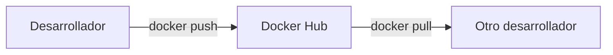
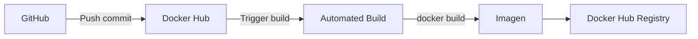

- [5. Compartiendo Imágenes y Registros](#5-compartiendo-imágenes-y-registros)
  - [5.1. Docker Hub y Gestión Remota](#51-docker-hub-y-gestión-remota)
    - [¿Qué es Docker Hub?](#qué-es-docker-hub)
    - [Buscar y Descargar Imágenes](#buscar-y-descargar-imágenes)
    - [Autenticación](#autenticación)
    - [Etiquetado de Imágenes](#etiquetado-de-imágenes)
    - [Subir Imágenes](#subir-imágenes)
  - [5.2. Automated Builds](#52-automated-builds)
    - [Configuración](#configuración)
  - [5.3. Registros Alternativos](#53-registros-alternativos)
    - [Registro Privado Local](#registro-privado-local)
  - [5.4. Ciclo Completo de Compartición](#54-ciclo-completo-de-compartición)


# 5. Compartiendo Imágenes y Registros

En este módulo aprenderás a compartir imágenes Docker usando Docker Hub y otros registros.

---

## 5.1. Docker Hub y Gestión Remota

### ¿Qué es Docker Hub?

Docker Hub es el **registro público y gratuito** gestionado por Docker, Inc. Es como una "tienda de aplicaciones" para imágenes Docker.



**Caracteristicas de Docker Hub:**

- Repositorios públicos ilimitados (gratuitos)
- Repositorios privados (limitados, requieren plan de pago)
- Automated Builds desde GitHub/Bitbucket
- Escaneo de vulnerabilidades

### Buscar y Descargar Imágenes

```bash
# Buscar imagen en Docker Hub
docker search nginx

# Buscar imagenes oficiales
docker search --filter "is-official=true" nginx

# Buscar con estrellas
docker search --filter stars=100 nginx

# Descargar imagen
docker pull nginx:alpine

# Descargar sin tag usa latest
docker pull nginx
```

**Campos de búsqueda:**

| Campo | Descripcion |
|-------|-------------|
| **REPOSITORY** | Nombre del repositorio |
| **DESCRIPTION** | Descripcion de la imagen |
| **STARS** | Popularidad |
| **OFFICIAL** | Imagen verificada por Docker |
| **AUTOMATED** | Build automatico desde código |

### Autenticación

```bash
# Iniciar sesion en Docker Hub
docker login

# Iniciar sesion con usuario
docker login -u nombre_usuario

# Cerrar sesion
docker logout
```

### Etiquetado de Imágenes

Antes de subir una imagen, debe tener el formato correcto:

```bash
# Sintaxis: docker tag IMAGEN_LOCAL REPOSITORIO_DESTINO

# Etiquetar imagen local
docker tag mi_imagen_local:v1 mi_usuario/mi_repositorio:v1

# Etiquetar con otro tag
docker tag mi_imagen:latest mi_usuario/mi_repositorio:1.0.0
```

> 📝 **Nota del Profesor:** "El formato para Docker Hub es USUARIO/NOMBRE:ETIQUETA. Sin el prefijo de usuario, Docker rechazara el push."

### Subir Imágenes

```bash
# Subir imagen a Docker Hub
docker push mi_usuario/mi_repositorio:v1

# Flujo completo: build, tag, push
docker build -t mi_usuario/mi_app:latest .
docker tag mi_usuario/mi_app:latest mi_usuario/mi_app:v1.0.0
docker push mi_usuario/mi_app:latest
docker push mi_usuario/mi_app:v1.0.0
```

---

## 5.2. Automated Builds

Los **Automated Builds** automatizan la creación de imágenes desde código fuente.

### Configuración

1. En Docker Hub, selecciona "Create" > "Create Automated Build"
2. Conecta tu cuenta de GitHub/Bitbucket
3. Selecciona el repositorio con Dockerfile
4. Configura triggers (commits a rama, tags)



**Ventajas de Automated Builds:**

- Siempre tienes la ultima version
- Travis CI integrado
- Versionado automatico
- Reconstruye cuando hay vulnerabilidades en la base

---

## 5.3. Registros Alternativos

| Registro | Tipo | Caracteristicas |
|----------|------|-----------------|
| **Docker Hub** | Publico/Privado | Por defecto, ilimitados publicos |
| **Quay.io** | Publico/Privado | Red Hat, escaneo de vulnerabilidades |
| **Amazon ECR** | Privado | Integracion con AWS |
| **Google GCR** | Privado | Integrado en Google Cloud |
| **Azure ACR** | Privado | Integrado en Azure |
| **Harbor** | Privado On-Prem | Open Source, RBAC |
| **Nexus** | Privado | Soporta multiples formatos |

### Registro Privado Local

```bash
# Ejecutar registro local
docker run -d -p 5000:5000 --restart=always --name mi_registro registry:2

# Etiquetar para registro local
docker tag mi_imagen:latest localhost:5000/mi_imagen:v1

# Subir al registro local
docker push localhost:5000/mi_imagen:v1

# Descargar del registro local
docker pull localhost:5000/mi_imagen:v1

# Listar imagenes en el registro
curl http://localhost:5000/v2/_catalog
```

> ⚠️ **Advertencia:** "Para usar un registro local con HTTPS, necesitas configurar certificados. Para desarrollo, puedes agregar el registro como inseguro en dockerd."

---

## 5.4. Ciclo Completo de Compartición

```bash
# 1. Desarrollar y probar localmente
docker build -t mi_app:latest .
docker run -d --name mi_app_test mi_app:latest

# 2. Etiquetar para produccion
docker tag mi_app:latest mi_usuario/mi_app:latest
docker tag mi_usuario/mi_app:latest mi_usuario/mi_app:v1.0.0

# 3. Subir a Docker Hub
docker login -u mi_usuario
docker push mi_usuario/mi_app:latest
docker push mi_usuario/mi_app:v1.0.0

# 4. En otro entorno, descargar y ejecutar
docker pull mi_usuario/mi_app:v1.0.0
docker run -d -p 80:8080 mi_usuario/mi_app:v1.0.0
```

> 💡 **Regla nemotecnica:** "Build locally, Tag correctly, Push to hub, Pull anywhere. El ciclo de comparticion de imagenes."
