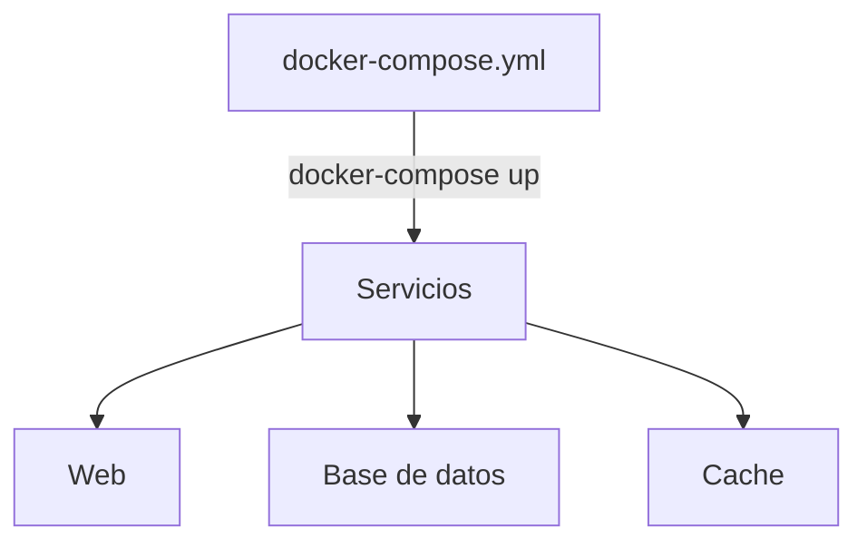
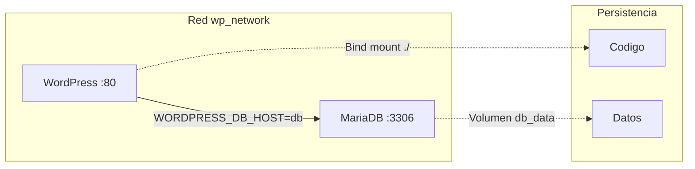

- [6. Docker Compose: Orquestación Local de Multicontenedores](#6-docker-compose-orquestación-local-de-multicontenedores)
  - [6.1. Introducción y Utilidad](#61-introducción-y-utilidad)
    - [¿Qué es Docker Compose?](#qué-es-docker-compose)
    - [Casos de Uso](#casos-de-uso)
    - [Instalación de Docker Compose](#instalación-de-docker-compose)
  - [6.2. Sintaxis del Archivo docker-compose.yml](#62-sintaxis-del-archivo-docker-composeyml)
    - [Estructura Principal](#estructura-principal)
    - [Definición de Servicios](#definición-de-servicios)
    - [Parámetros de Servicio](#parámetros-de-servicio)
  - [6.3. Ejemplo Completo: WordPress + MariaDB](#63-ejemplo-completo-wordpress--mariadb)
  - [6.4. Comandos de Docker Compose](#64-comandos-de-docker-compose)
    - [Ejecución](#ejecución)
    - [Detención](#detención)
    - [Logs y Monitoreo](#logs-y-monitoreo)
    - [Acceso y Ejecución](#acceso-y-ejecución)
    - [Ciclo de Vida Completo](#ciclo-de-vida-completo)
  - [6.5. Variables de Entorno en Compose](#65-variables-de-entorno-en-compose)


# 6. Docker Compose: Orquestación Local de Multicontenedores

En este módulo aprenderás a usar Docker Compose para gestionar aplicaciones multi-contenedor de forma sencilla.

---

## 6.1. Introducción y Utilidad

### ¿Qué es Docker Compose?

Docker Compose es una **herramienta para definir y ejecutar aplicaciones multi-contenedor**. Usa un archivo YAML para configurar todos los servicios.



> 📝 **Nota del Profesor:** "Compose es como el director de orquesta: coordina que todos los instrumentos contenedores suenen juntos en armonia."

### Casos de Uso

| Caso | Descripcion | Beneficio |
|------|-------------|-----------|
| **Desarrollo** | Entorno completo con DB, web, cache | Un solo comando levanta todo |
| **Testing** | Entornos efimeros para CI/CD | Rapido de crear/destruir |
| **Produccion simple** | Aplicaciones en un solo host | Simplicidad de gestion |

### Instalación de Docker Compose

```bash
# Incluido en Docker Desktop
docker-compose --version

# Instalacion independiente (Linux)
sudo curl -L "https://github.com/docker/compose/releases/latest/download/docker-compose-$(uname -s)-$(uname -m)" \
    -o /usr/local/bin/docker-compose
sudo chmod +x /usr/local/bin/docker-compose
```

---

## 6.2. Sintaxis del Archivo docker-compose.yml

### Estructura Principal

```yaml
version: '3.8'  # Version del formato

services:       # Contenedores
  servicio1:
    image: imagen
    ...
  servicio2:
    build: ./directorio
    ...

volumes:        # Volumenes persistentes
  mi_volumen:

networks:       # Redes
  mi_red:
```

### Definición de Servicios

```yaml
version: '3.8'
services:
  # Definir servicio web
  web:
    image: nginx:alpine
    container_name: mi_web
    ports:
      - "8080:80"
    volumes:
      - ./html:/usr/share/nginx/html
    environment:
      - NGINX_HOST=localhost
    depends_on:
      - db
    networks:
      - mi_red

  # Definir base de datos
  db:
    image: mysql:8
    container_name: mi_db
    volumes:
      - db_data:/var/lib/mysql
    environment:
      - MYSQL_ROOT_PASSWORD=secret
      - MYSQL_DATABASE=mi_app
    networks:
      - mi_red

  # Construir desde Dockerfile
  api:
    build: .
    container_name: mi_api
    ports:
      - "3000:3000"
    environment:
      - DB_HOST=db
      - DB_PORT=3306
    networks:
      - mi_red

volumes:
  db_data:

networks:
  mi_red:
```

### Parámetros de Servicio

| Parametro | Equivalente CLI | Descripcion |
|-----------|-----------------|-------------|
| `image` | `docker run IMAGEN` | Imagen a usar |
| `build` | `docker build` | Construir desde Dockerfile |
| `container_name` | `--name` | Nombre del contenedor |
| `ports` | `-p` | Mapeo de puertos |
| `volumes` | `-v` | Volumenes y bind mounts |
| `environment` | `-e` | Variables de entorno |
| `depends_on` | `--link` (obsoleto) | Dependencias entre servicios |
| `networks` | `--net` | Red del servicio |
| `command` | CMD | Sobrescribir comando |
| `entrypoint` | ENTRYPOINT | Sobrescribir entrypoint |

> 💡 **Tip del Examinador:** Pregunta tipica: "¿Cual es la diferencia entre depends_on y links?"
> **Respuesta:** depends_on define orden de inicio (el servicio B espera a A). links era para comunicacion y esta obsoleto en redes definidas por usuario."

---

## 6.3. Ejemplo Completo: WordPress + MariaDB

```yaml
version: '3.8'

services:
  db:
    image: mariadb:10.5
    container_name: mariadb
    volumes:
      - db_data:/var/lib/mysql
    environment:
      - MYSQL_ROOT_PASSWORD=secret
      - MYSQL_DATABASE=wordpress
      - MYSQL_USER=manager
      - MYSQL_PASSWORD=secret
    networks:
      - wp_network
    healthcheck:
      test: ["CMD", "healthcheck.sh", "--connect", "--innodb_initialized"]
      interval: 10s
      timeout: 5s
      retries: 5

  wordpress:
    image: wordpress:5.8
    container_name: wordpress
    depends_on:
      - db
    volumes:
      - ./wordpress:/var/www/html
    environment:
      - WORDPRESS_DB_USER=manager
      - WORDPRESS_DB_PASSWORD=secret
      - WORDPRESS_DB_HOST=db
      - WORDPRESS_DB_NAME=wordpress
    ports:
      - "8080:80"
    networks:
      - wp_network
    restart: unless-stopped

volumes:
  db_data:

networks:
  wp_network:
```



---

## 6.4. Comandos de Docker Compose

### Ejecución

```bash
# Construir y ejecutar en primer plano
docker-compose up

# Construir y ejecutar en segundo plano
docker-compose up -d

# Escalar servicio
docker-compose up -d --scale web=3

# Especificar archivo
docker-compose -f prod.yml up -d
```

### Detención

```bash
# Detener contenedores (mantiene recursos)
docker-compose stop

# Detener y eliminar contenedores
docker-compose down

# Detener y eliminar contenedores + volumenes
docker-compose down -v

# Detener y eliminar contenedores + volumenes + imagenes
docker-compose down -v --rmi local

# Eliminar solo contenedores detenidos
docker-compose rm
```

### Logs y Monitoreo

```bash
# Ver logs de todos los servicios
docker-compose logs

# Ver logs en tiempo real
docker-compose logs -f

# Logs con marca de tiempo
docker-compose logs -ft

# Ver estado de servicios
docker-compose ps

# Ver estadisticas
docker-compose top
```

### Acceso y Ejecución

```bash
# Ejecutar comando en servicio
docker-compose exec web ls /var/www/html

# Acceso interactivo
docker-compose exec web /bin/bash

# Construir imagenes definidas con build
docker-compose build

# Forzar reconstruccion
docker-compose build --no-cache

# Ver servicios activos
docker-compose ps
```

### Ciclo de Vida Completo

```bash
# Levantar entorno
docker-compose up -d

# Verificar estado
docker-compose ps

# Ver logs
docker-compose logs -f

# Hacer cambios y rebuild
docker-compose up -d --build

# Detener todo
docker-compose down
```

> 💡 **Regla nemotecnica:** "UP para levantar, DOWN para bajar, PS para ver, LOGS para ver que pasa. Los 4 comandos basicos de Compose."

---

## 6.5. Variables de Entorno en Compose

```yaml
version: '3.8'
services:
  mi_servicio:
    image: mi_imagen
    environment:
      # Variable simple
      - ENTORNO=produccion
      # Desde archivo .env
      - ${MI_VARIABLE}
      # Con valor por defecto
      - DB_HOST=${DB_HOST:-localhost}
```

**.env file:**

```bash
# .env
DB_HOST=mi-db-server
DB_PORT=5432
SECRET_KEY=mi_clave_secreta
```
