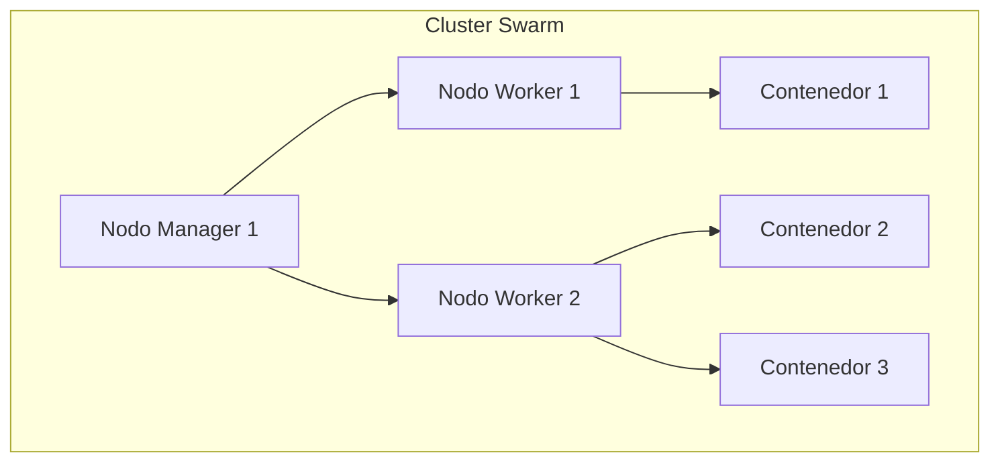
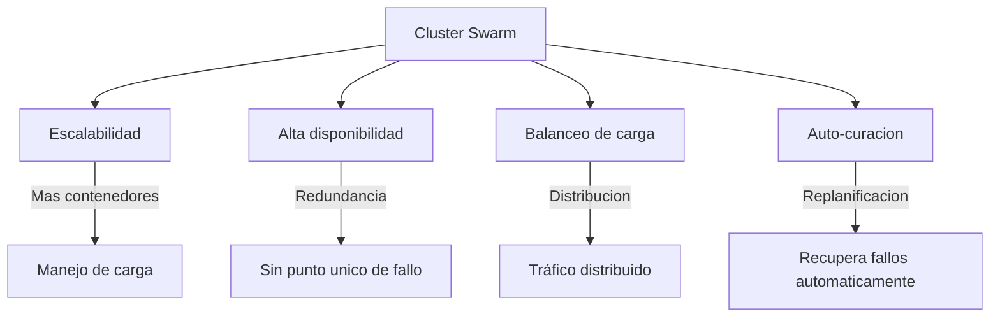
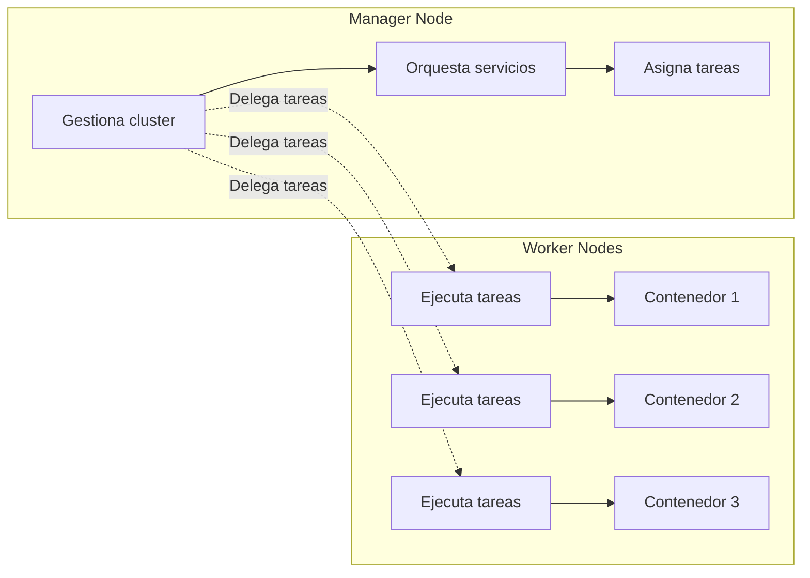
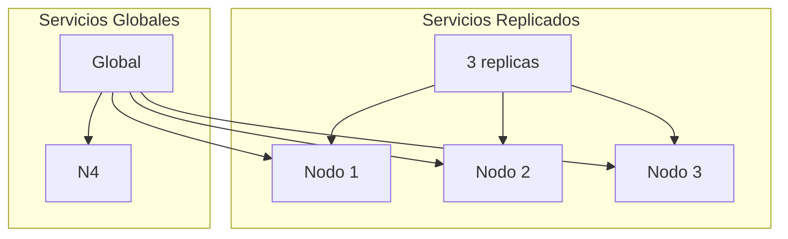
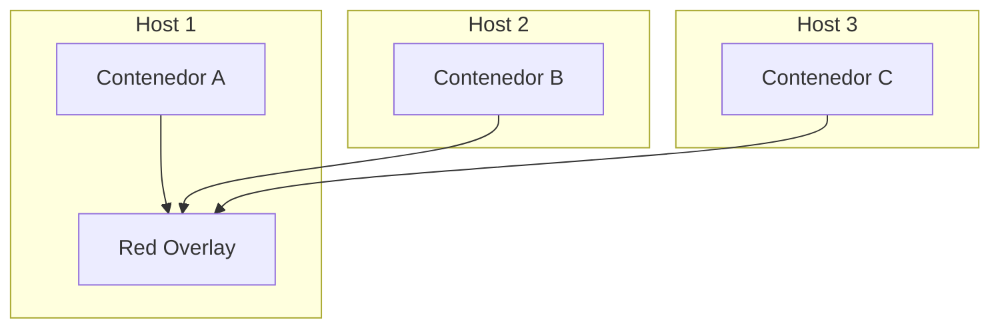
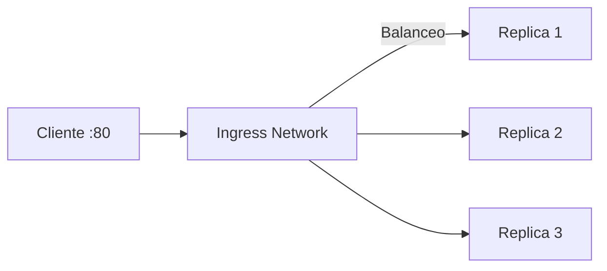
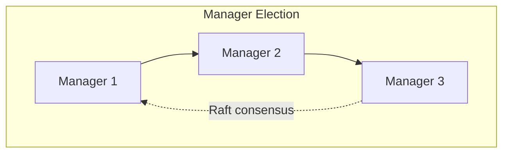

- [7. Docker Swarm: Orquestación Distribuida](#7-docker-swarm-orquestación-distribuida)
  - [7.1. Fundamentos de Orquestación Distribuida](#71-fundamentos-de-orquestación-distribuida)
    - [¿Qué es Docker Swarm?](#qué-es-docker-swarm)
    - [¿Cuándo Usar Swarm?](#cuándo-usar-swarm)
    - [Objetivos de Swarm](#objetivos-de-swarm)
  - [7.2. Arquitectura de Swarm](#72-arquitectura-de-swarm)
    - [Roles: Manager vs Worker](#roles-manager-vs-worker)
    - [Configuración Inicial](#configuración-inicial)
    - [Tipos de Servicios](#tipos-de-servicios)
  - [7.3. Despliegue con Stacks](#73-despliegue-con-stacks)
    - [Docker Stack (Compose para Swarm)](#docker-stack-compose-para-swarm)
    - [Desplegar Stack](#desplegar-stack)
  - [7.4. Redes Overlay en Swarm](#74-redes-overlay-en-swarm)
    - [Definir Red Overlay](#definir-red-overlay)
    - [Balanceo de Carga en Swarm](#balanceo-de-carga-en-swarm)
  - [7.5. Gestión del Cluster](#75-gestión-del-cluster)
    - [Escalado](#escalado)
    - [Actualizaciones](#actualizaciones)
    - [Alta Disponibilidad](#alta-disponibilidad)
  - [7.6. Comandos Esenciales de Swarm](#76-comandos-esenciales-de-swarm)


# 7. Docker Swarm: Orquestación Distribuida

En este módulo aprenderás a usar Docker Swarm para orquestar contenedores en un cluster de múltiples máquinas.

---

## 7.1. Fundamentos de Orquestación Distribuida

### ¿Qué es Docker Swarm?

Docker Swarm es la **herramienta nativa de Docker** para gestionar y orquestar contenedores en un **cluster** de varias máquinas.



> 📝 **Nota del Profesor:** "Swarm convierte multiples maquinas en un unico sistema. Tu mandas un comando y Swarm decide donde ejecutarlo paraoptimo."

### ¿Cuándo Usar Swarm?

| Situacion | Herramienta |
|-----------|-------------|
| Un solo host | Docker CLI |
| Multiples hosts, simple | Docker Compose |
| Produccion distribuida | Docker Swarm |
| Enterprise, multiples clusters | Kubernetes |

### Objetivos de Swarm



---

## 7.2. Arquitectura de Swarm

### Roles: Manager vs Worker



| Rol | Funciones |
|-----|-----------|
| **Manager** | Gestiona el cluster, delega tareas, mantiene estado |
| **Worker** | Hospeda y ejecuta contenedores |

### Configuración Inicial

```bash
# Inicializar Swarm (en el primer nodo manager)
docker swarm init

# Unirse como worker
docker swarm join --token SWMTKN-1-xxxxx IP_MANAGER:2377

# Unirse como manager
docker swarm join-token manager

# Ver nodos del cluster
docker node ls

# Ver informacion de nodo
docker node inspect self

# Abandonar Swarm
docker swarm leave --force
```

### Tipos de Servicios

```bash
# Servicio replicado (numero definido de instancias)
docker service create --replicas 3 --name mi_web nginx

# Servicio global (una instancia en cada nodo)
docker service create --mode global --name monitor mi_monitor
```



---

## 7.3. Despliegue con Stacks

### Docker Stack (Compose para Swarm)

```yaml
# docker-compose.yml para Swarm
version: '3.8'

services:
  web:
    image: nginx:latest
    ports:
      - "80:80"
    deploy:
      replicas: 3
      endpoint_mode: vip
      resources:
        limits:
          cpus: '0.5'
          memory: 256M
    networks:
      - mi_red

  api:
    image: mi_api:latest
    deploy:
      replicas: 2
      update_config:
        parallelism: 1
        delay: 10s
      restart_policy:
        condition: on-failure
    networks:
      - mi_red

networks:
  mi_red:
    driver: overlay
```

### Desplegar Stack

```bash
# Desplegar stack
docker stack deploy -c docker-compose.yml mi_stack

# Ver stacks
docker stack ls

# Ver servicios del stack
docker stack services mi_stack

# Ver tareas (contenedores) del stack
docker stack ps mi_stack

# Eliminar stack
docker stack rm mi_stack
```

---

## 7.4. Redes Overlay en Swarm

Las redes **overlay** permiten comunicación entre contenedores en diferentes hosts.



### Definir Red Overlay

```yaml
version: '3.8'
services:
  servicio1:
    image: nginx
    networks:
      - red_overlay

  servicio2:
    image: mi_app
    networks:
      - red_overlay

networks:
  red_overlay:
    driver: overlay
    attachable: true  # Permite adjuntar contenedores no-servicio
```

### Balanceo de Carga en Swarm



- Swarm crea automaticamente una red **ingress** con balanceo de carga
- Cualquier nodo del cluster puede recibir trafico
- El balanceo se distribuye entre todas las replicas

---

## 7.5. Gestión del Cluster

### Escalado

```bash
# Escalar servicio
docker service scale mi_stack_web=5

# Ver replicas
docker service ps mi_stack_web
```

### Actualizaciones

```bash
# Actualizar imagen de servicio
docker service update --image nginx:1.21 mi_stack_web

# Rolling update con configuracion
docker service update \
    --image nginx:1.21 \
    --update-parallelism 2 \
    --update-delay 10s \
    mi_stack_web
```

### Alta Disponibilidad



- Swarm usa **Raft consensus** para alta disponibilidad
- Se recomiendan **3 o 5 managers** (nunca par)
- Si un manager falla, otro toma el control

> 💡 **Regla nemotecnica:** "Manager para orquestar, Worker para ejecutar. 3 managers para HA, N workers para capacidad."

---

## 7.6. Comandos Esenciales de Swarm

| Comando | Descripcion |
|---------|-------------|
| `docker swarm init` | Inicializar cluster |
| `docker swarm join` | Unirse al cluster |
| `docker node ls` | Ver nodos |
| `docker service create` | Crear servicio |
| `docker service ls` | Ver servicios |
| `docker service ps` | Ver tareas |
| `docker stack deploy` | Desplegar stack |
| `docker stack ls` | Ver stacks |
