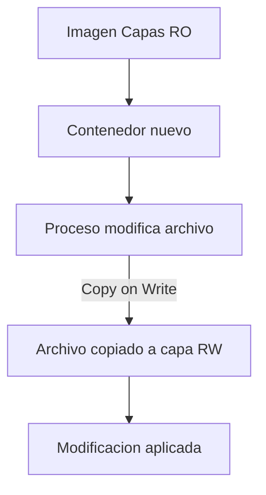
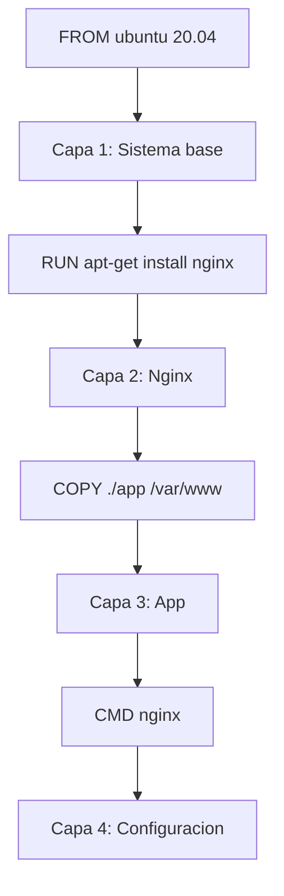
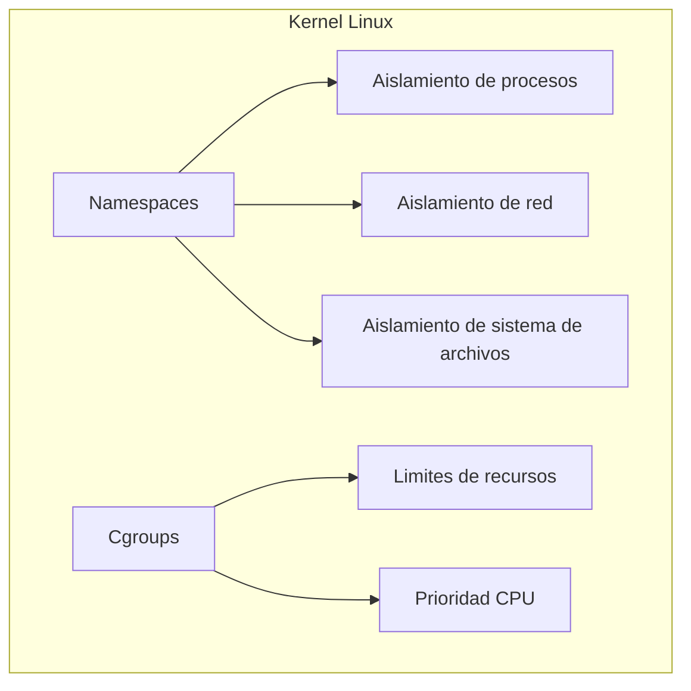
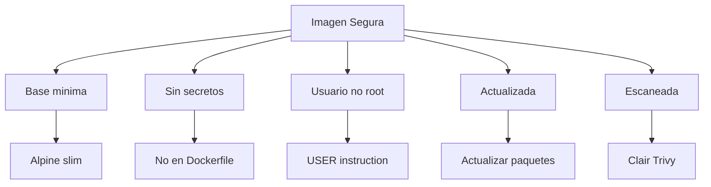

- [8. Conceptos Internos y Seguridad Avanzada](#8-conceptos-internos-y-seguridad-avanzada)
  - [8.1. Mecanismos Internos de Docker](#81-mecanismos-internos-de-docker)
    - [Copy-on-Write (CoW)](#copy-on-write-cow)
    - [Almacenamiento por Capas (Layers)](#almacenamiento-por-capas-layers)
    - [Content Addressable Storage (CAS)](#content-addressable-storage-cas)
    - [Componentes del Kernel](#componentes-del-kernel)
  - [8.2. Seguridad y Hardening](#82-seguridad-y-hardening)
    - [Denegar Root](#denegar-root)
    - [Verificación de Integridad](#verificación-de-integridad)
    - [Docker Content Trust (DCT)](#docker-content-trust-dct)
    - [Análisis de Vulnerabilidades](#análisis-de-vulnerabilidades)
    - [Mejores Prácticas de Seguridad](#mejores-prácticas-de-seguridad)
    - [Restricción de Tráfico](#restricción-de-tráfico)
  - [8.3. Checklist de Seguridad Docker](#83-checklist-de-seguridad-docker)


# 8. Conceptos Internos y Seguridad Avanzada

En este módulo aprenderás cómo funciona Docker internamente y las prácticas de seguridad avanzadas.

---

## 8.1. Mecanismos Internos de Docker

### Copy-on-Write (CoW)

El mecanismo **Copy-on-write** permite eficiencia en espacio y velocidad de arranque.



**Como funciona CoW:**

1. El contenedor inicia con capas de solo lectura de la imagen
2. Se añade una capa de lectura/escritura (RW)
3. Si un proceso modifica un archivo de las capas base:
   - El archivo se copia a la capa RW
   - Solo se modifica la copia
   - El archivo original permanece intacto

> 💡 **Tip del Examinador:** Pregunta tipica: "¿Que es Copy-on-Write y cual es su ventaja?"
> **Respuesta:** CoW permite que los contenedores sean eficientes porque no copian archivos hasta que se modifican. Muchos contenedores pueden compartir los mismos archivos base."

### Almacenamiento por Capas (Layers)



**Caracteristicas de las capas:**

- Cada instruccion del Dockerfile genera una capa
- Las capas son de solo lectura (excepto la ultima)
- Se comparten entre imagenes con el mismo contenido
- El Union Filesystem las combina

### Content Addressable Storage (CAS)

Desde Docker 1.10, cada capa e imagen se identifica por su **SHA256 hash**:

```bash
# Ver hash de una imagen
docker inspect mi_imagen | grep -i digest

# Ver todas las capas de una imagen
docker history mi_imagen
```

**Ventajas de CAS:**

- **Integridad**: Si el contenido cambia, el hash cambia
- **Comparticion**: Capas identicas comparten el mismo hash
- **Deduplicacion**: No hay datos duplicados

### Componentes del Kernel



| Componente | Funcion | Docker usa |
|------------|---------|------------|
| **Namespaces** | Aislamiento de procesos, red, FS, etc. | Si |
| **Cgroups** | Limites de CPU, memoria, I/O | Si |
| **Capabilities** | Privilegios granulares | Si |
| **Seccomp** | Filtrado de syscalls | Si |
| **AppArmor/SELinux** | Control de acceso Mandatory | Si |

---

## 8.2. Seguridad y Hardening

### Denegar Root

```dockerfile
# ❌ PELIGROSO: Ejecutar como root
FROM nginx
CMD ["nginx", "-g", "daemon off;"]

# ✅ SEGURO: Usuario no root
FROM nginx
RUN useradd -m -s /bin/bash appuser
USER appuser
CMD ["nginx", "-g", "daemon off;"]
```

> 💡 **Regla nemotecnica:** "Root dentro del contenedor no es root fuera. Pero minimiza riesgos ejecutando como no-root siempre."

### Verificación de Integridad

```bash
# Verificar hash de imagen
docker inspect mi_imagen

# Verificar integridad despues de pull
docker pull --quiet mi_imagen | docker load

# Content Trust (firma digital)
export DOCKER_CONTENT_TRUST=1
docker pull mi_imagen
```

### Docker Content Trust (DCT)

```bash
# Habilitar DCT
export DOCKER_CONTENT_TRUST=1

# Ahora solo se permiten imagenes firmadas
docker pull mi_imagen
```

**Que hace DCT:**

- Verifica que la imagen fue publicada por el propietario
- Protege contra imagenes modificadas por atacantes
- Usa Notary para gestion de firmas

### Análisis de Vulnerabilidades

```bash
# Escaneo basico con Docker Hub
# Automatico para imagenes oficiales

# Usar herramientas externas
# Clair, Trivy, Anchore

# Ejemplo con Trivy
trivy image mi_imagen
```

### Mejores Prácticas de Seguridad



| Practica | Implementacion |
|----------|----------------|
| **Imagen minima** | `FROM alpine:3.19` o `node:18-alpine` |
| **No root** | `USER nobody` o crear usuario |
| **Sin secretos** | Variables de entorno, no en imagen |
| **Permisos** | `COPY --chmod` archivos con permisos correctos |
| **Actualizaciones** | Actualizar paquetes regularmente |
| **Escaneo** | Trivy, Clair, Docker Hub scan |

### Restricción de Tráfico

```bash
# Deshabilitar comunicacion entre contenedores
dockerd --icc=false

# Limitar capacidades
docker run --cap-drop ALL --cap-add NET_BIND_SERVICE mi_imagen

# No Privilegiado
docker run --privileged=false mi_imagen

# Read-only filesystem
docker run --read-only mi_imagen
```

> 📝 **Nota del Profesor:** "La seguridad en Docker es defense in depth. Multiples capas de proteccion: imagen minima, no root, capabilities limitadas, lectura sola, analisis de vulnerabilidades."

---

## 8.3. Checklist de Seguridad Docker

- [ ] Usar imagen base minima (alpine, slim)
- [ ] Especificar versiones exactas, no latest
- [ ] No incluir secretos o credenciales en imagen
- [ ] Ejecutar como usuario no root
- [ ] Minimizar numero de capas
- [ ] Incluir HEALTHCHECK
- [ ] Usar .dockerignore
- [ ] Escanear imagenes en CI/CD
- [ ] Habilitar Content Trust para imagenes sensibles
- [ ] Limitar capabilities del contenedor
- [ ] Usar red apropiada (no host si no es necesario)
- [ ] Considerar --read-only para production
- [ ] Mantener Docker actualizado
