- [9. Resumen y Conclusiones](#9-resumen-y-conclusiones)
  - [9.1. Mapa Conceptual de la Unidad](#91-mapa-conceptual-de-la-unidad)
  - [9.2. Conceptos Clave Detallados](#92-conceptos-clave-detallados)
    - [Docker y Contenedores](#docker-y-contenedores)
    - [Comandos Esenciales](#comandos-esenciales)
    - [Dockerfile](#dockerfile)
    - [Persistencia y Redes](#persistencia-y-redes)
    - [Docker Compose](#docker-compose)
    - [Docker Swarm](#docker-swarm)
  - [9.3. Principios y Buenas Practicas](#93-principios-y-buenas-practicas)
    - [Imagenes Seguras](#imagenes-seguras)
    - [Contenedores Eficientes](#contenedores-eficientes)
    - [Produccion](#produccion)
  - [9.4. Checklist de Supervivencia](#94-checklist-de-supervivencia)
    - [Conceptos Basicos](#conceptos-basicos)
    - [Comandos CLI](#comandos-cli)
    - [Imagenes y Dockerfile](#imagenes-y-dockerfile)
    - [Persistencia](#persistencia)
    - [Composicion y Orquestacion](#composicion-y-orquestacion)
    - [Seguridad](#seguridad)
  - [9.5. Errores Comunes a Evitar](#95-errores-comunes-a-evitar)
  - [9.6. Recursos Adicionales](#96-recursos-adicionales)
    - [Documentacion Oficial](#documentacion-oficial)
    - [Herramientas](#herramientas)
    - [Cheat Sheet Comandos](#cheat-sheet-comandos)


# 9. Resumen y Conclusiones

En esta unidad hemos explorado Docker, la plataforma de contenedores mas popular para virtualizacion ligera.

---

## 9.1. Mapa Conceptual de la Unidad

```mermaid
graph TD
    UD02[UD02 Docker Contenedores] --> FUND[Fundamentos]
    UD02 --> COMANDOS[Comandos CLI]
    UD02 --> IMAGENES[Imagenes Dockerfile]
    UD02 --> PERSISTENCIA[Persistencia Redes]
    UD02 --> REGISTROS[Registros Docker Hub]
    UD02 --> COMPOSE[Docker Compose]
    UD02 --> SWARM[Docker Swarm]
    UD02 --> SEGURIDAD[Seguridad]

    FUND --> QUE[Que es Docker]
    FUND --> CONTENEDORES[Contenedores vs VMs]
    FUND --> ARQUITECTURA[Arquitectura]

    COMANDOS --> INSTALACION[Instalacion]
    COMANDOS --> CICLO[Ciclo de vida]
    COMANDOS --> EJECUCION[Ejecucion acceso]

    IMAGENES --> DOCKERFILE[Dockerfile]
    IMAGENES --> BUILD[docker build]
    IMAGENES --> OPTIMIZACION[Optimizacion]

    PERSISTENCIA --> VOLUMENES[Volumenes]
    PERSISTENCIA --> BIND[Bind Mounts]
    PERSISTENCIA --> REDES[Redes Docker]

    REGISTROS --> HUB[Docker Hub]
    REGISTROS --> PUSH_PULL[docker push pull]
    REGISTROS --> ALTERNATIVOS[Registros alternativos]

    COMPOSE --> YAML[docker-compose.yml]
    COMPOSE --> COMANDOS_C[Comandos Compose]
    COMPOSE --> EJEMPLOS[Ejemplos]

    SWARM --> CLUSTER[Cluster Swarm]
    SWARM --> MANAGER[Manager Worker]
    SWARM --> STACKS[Stacks]

    SEGURIDAD --> CAPAS[Capas CoW]
    SEGURIDAD --> NAMESPACES[Namespaces Cgroups]
    SEGURIDAD --> HARDENING[Hardening]
```



---

## 9.2. Conceptos Clave Detallados

### Docker y Contenedores

**Que es Docker:**
Plataforma de codigo abierto para desarrollar, enviar y ejecutar aplicaciones en contenedores.

**Contenedor vs VM:**

| Aspecto | Contenedor | Maquina Virtual |
|---------|------------|-----------------|
| Peso | MB | GB |
| Arranque | Segundos | Minutos |
| SO | Comparte kernel | SO huesped completo |
| Aislamiento | Namespaces | Hipervisor |

**Arquitectura Docker:**

- **Docker Client**: CLI que envia comandos
- **Docker Daemon**: Servidor que gestiona objetos
- **Imagenes**: Plantillas de solo lectura
- **Contenedores**: Instancias ejecutables
- **Registros**: Repositorios de imagenes

### Comandos Esenciales

| Comando | Funcion |
|---------|---------|
| `docker run` | Crear y ejecutar contenedor |
| `docker ps` | Listar contenedores |
| `docker exec` | Ejecutar en contenedor |
| `docker build` | Construir imagen |
| `docker push/pull` | Compartir imagenes |
| `docker-compose up` | Levantar multicontenedor |

### Dockerfile

**Instrucciones principales:**

| Instruccion | Proposito |
|-------------|-----------|
| `FROM` | Imagen base |
| `RUN` | Ejecutar comando |
| `COPY` | Copiar archivos |
| `CMD` | Comando por defecto |
| `ENTRYPOINT` | Comando principal |
| `ENV` | Variable de entorno |
| `WORKDIR` | Directorio de trabajo |
| `USER` | Usuario de ejecucion |

### Persistencia y Redes

**Volumenes vs Bind Mounts:**

- **Volumenes**: Gestionados por Docker, persistentes
- **Bind Mounts**: Directorios del host, desarrollo

**Modos de red:**

- **bridge**: Red interna con NAT
- **host**: Comparte red del host
- **overlay**: Multi-host (Swarm)

### Docker Compose

```yaml
version: '3'
services:
  web:
    image: nginx
    ports:
      - "80:80"
  db:
    image: mysql
    volumes:
      - db_data:/var/lib/mysql
volumes:
  db_data:
```

### Docker Swarm

- **Manager**: Gestiona el cluster
- **Worker**: Ejecuta contenedores
- **Stack**: Aplicacion multicontenedor en Swarm
- **Servicio**: Definicion de contenedores a ejecutar

---

## 9.3. Principios y Buenas Practicas

### Imagenes Seguras

- Usar imagenes base minimizadas (alpine, slim)
- No incluir secretos en imagenes
- Ejecutar como usuario no root
- Escanear vulnerabilidades regularmente
- Usar Content Trust

### Contenedores Eficientes

- Un proceso por contenedor
- Usar HEALTHCHECK
- Minimizar numero de capas
- Aprovechar cache de construccion
- Multi-stage builds para reducir tamaño

### Produccion

- Usar Compose o Swarm para orquestacion
- Configurar restart policies
- Usar redes definidas por usuario
- Gestionar logs correctamente
- Monitorear contenedores

---

## 9.4. Checklist de Supervivencia

Antes de dar por cerrada la unidad, asegurate de poder responder SI a estas preguntas:

### Conceptos Basicos
- [ ] ¿Puedo explicar que es un contenedor Docker?
- [ ] ¿Entiendo la diferencia entre contenedor e imagen?
- [ ] ¿Conozco la diferencia entre contenedores y VMs?

### Comandos CLI
- [ ] ¿Se usar docker run con opciones basicas?
- [ ] ¿Puedo listar, iniciar, detener y eliminar contenedores?
- [ ] ¿Se acceder a la shell de un contenedor en ejecucion?
- [ ] ¿Entiendo los modos detached e interactivo?

### Imagenes y Dockerfile
- [ ] ¿Puedo crear una imagen desde un Dockerfile?
- [ ] ¿Conozco las instrucciones principales del Dockerfile?
- [ ] ¿Entiendo la diferencia entre CMD y ENTRYPOINT?
- [ ] ¿Se optimizar un Dockerfile para reducir tamaño?

### Persistencia
- [ ] ¿Se crear y usar volumenes?
- [ ] ¿Entiendo cuando usar volumenes vs bind mounts?
- [ ] ¿Conozco los diferentes modos de red en Docker?

### Composicion y Orquestacion
- [ ] ¿Puedo crear un archivo docker-compose.yml basico?
- [ ] ¿Se levantar un entorno multicontenedor con Compose?
- [ ] ¿Entiendo la diferencia entre Compose y Swarm?

### Seguridad
- [ ] ¿Se por que no se debe ejecutar como root?
- [ ] ¿Conozco que es y como funciona CoW?
- [ ] ¿Se las mejores practicas de seguridad?

---

## 9.5. Errores Comunes a Evitar

| Error | Solucion |
|-------|----------|
| Contenedor se detiene al salir | Usar modo detached `-d` o `-it` |
| Datos perdidos | Usar volumenes para persistencia |
| Conflicto de puertos | Verificar que no hay otro proceso usando el puerto |
| Permiso denegado | Añadir usuario al grupo docker o usar sudo |
| No funciona en otro host | Usar misma version de Docker, verificar imagen |
| Imagen muy grande | Multi-stage build, eliminar caches |
| No puede acceder a servicio | Verificar mapeo de puertos y red |

---

## 9.6. Recursos Adicionales

### Documentacion Oficial
- [Docker](https://docs.docker.com)
- [Docker Hub](https://hub.docker.com)
- [Docker Compose](https://docs.docker.com/compose)

### Herramientas
- [Docker Desktop](https://www.docker.com/products/docker-desktop)
- [Play with Docker](https://labs.play-with-docker.com)
- [Docker Playground](https://docker.com/try-playground)

### Cheat Sheet Comandos

```bash
# Contenedores
docker run -d -p 8080:80 nginx
docker ps -a
docker logs -f nombre
docker exec -it nombre /bin/bash

# Imagenes
docker build -t nombre .
docker images
docker rmi nombre

# Compose
docker-compose up -d
docker-compose down
docker-compose ps
```

> 💡 **Regla de oro:** "Si funciona en mi maquina, funciona en la tuya. Ese es el poder de Docker."
